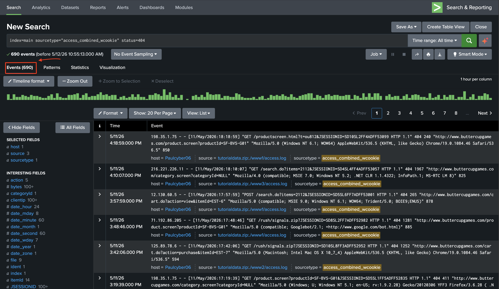
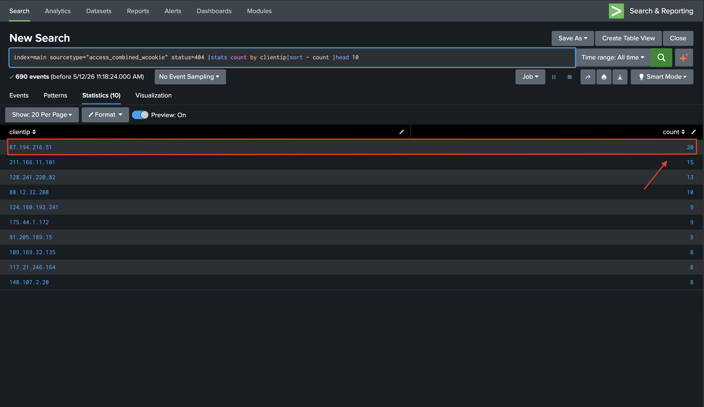
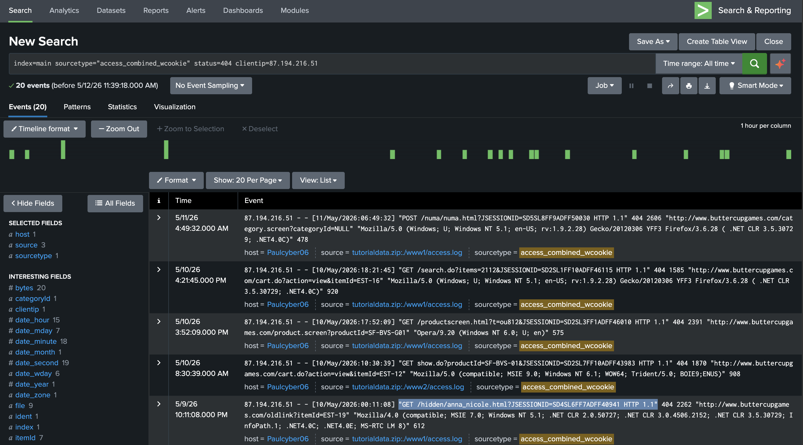
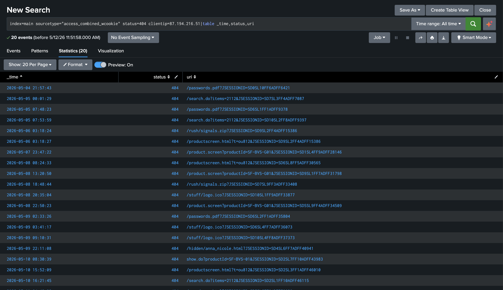

# Épisode 2 — Splunk : Détection d'une Reconnaissance Web

> Deuxième incident dans la série d'attaques contre **Buttercup Games** — l'attaquant, ayant échoué par phishing, sonde maintenant directement le serveur web à la recherche de fichiers sensibles.

---

## Table des matières

1. [Contexte](#1-contexte)
2. [Observation initiale](#2-observation-initiale)
3. [Analyse — Top 10 des adresses IP](#3-analyse--top-10-des-adresses-ip)
4. [Analyse — Comportement de l'IP suspecte](#4-analyse--comportement-de-lip-suspecte)
5. [Analyse — Reconstruction de la navigation](#5-analyse--reconstruction-de-la-navigation)
6. [Conclusion](#6-conclusion)
7. [Réponse opérationnelle SOC](#7-réponse-opérationnelle-soc)

---

## 1. Contexte

Quelques jours après la tentative de phishing, les logs du serveur web de Buttercup Games révèlent une activité anormale. Une adresse IP inconnue sonde activement l'application web à la recherche de fichiers sensibles — notamment `/passwords.pdf`.

Le SOC lance une investigation via Splunk pour identifier et caractériser cette activité de reconnaissance. L'attaquant, n'ayant pas réussi à piéger un employé par phishing, tente maintenant d'obtenir directement des informations d'accès.

---

## 2. Observation initiale

Pour commencer l'investigation, on utilise la barre de recherche avec la commande suivante :

```spl
index=main sourcetype="access_combined_wcookie" status=404
```

Nous obtenons **690 événements**.

Cela représente le nombre total de requêtes `404` émises sur l'ensemble des logs de ce fichier.

Pour rappel, les requêtes `404` correspondent au statut **"Page not found"** : une demande d'une ressource qui n'existe pas sur notre serveur.

Cela peut arriver dans des cas normaux :
- Un utilisateur tape une mauvaise URL
- Un lien cassé sur le site
- Une page supprimée

  



> ⚠️ 690 événements méritent une investigation pour s'assurer qu'aucune IP ne concentre un volume anormal de requêtes. On considère que 1 à 2 requêtes 404 par adresse IP reste relativement normal. À l'inverse, une IP qui revient régulièrement sur les mêmes URLs sensibles devient une situation anormale et pourrait signifier une reconnaissance active en cours.

---

## 3. Analyse — Top 10 des adresses IP

On continue avec la requête suivante :

```spl
index=main sourcetype="access_combined_wcookie" status=404
| stats count by clientip
| sort - count
| head 10
```



Nous trouvons **10 adresses IP** au total, avec la première qui cumule **20 requêtes**. Rien d'anormal dans la vie de tous les jours, mais dans notre scénario, nous allons considérer que cela est étrange afin de faciliter la suite de l'enquête.​

---

## 4. Analyse — Comportement de l'IP suspecte

Nous allons essayer de savoir ce que recherchait l'adresse `87.194.216.51`, afin de déterminer si ce sont uniquement des requêtes avec des URLs erronées — potentiellement supprimées depuis peu — ou bien une tentative de découverte de contenu caché.

Nous exécutons la requête :

```spl
index=main sourcetype="access_combined_wcookie" status=404 clientip=87.194.216.51
```


| Observation | Interprétation |
|---|---|
| Requêtes espacées dans le temps | Probablement une personne réelle, pas un scanner automatisé |
| Accès à des pages inexistantes | Navigation hors des sentiers battus |
| Tentative d'accès à `.../hidden/anna_nicole.html` | Recherche de contenu caché avec le nom d'une collaboratrice |

> ⚠️ La ligne `.../hidden/anna_nicole.html` est particulièrement suspecte. La personne essaie de trouver un contenu caché portant le nom d'une collaboratrice de la société.


---

## 5. Analyse — Reconstruction de la navigation

On décide d'élargir l'investigation et d'essayer de comprendre ce que cette IP cherche à faire, en examinant **toutes les URLs** qu'elle a tenté d'atteindre.

```spl
index=main sourcetype="access_combined_wcookie" clientip=87.194.216.51
| table _time, status, uri
```



En examinant cette dernière capture, on peut voir que l'attaquant essaie d'accéder à des fichiers très confidentiels, comme par exemple `passwords.pdf` — et ce **3 fois**, à des dates différentes.


---

## 6. Conclusion

> 🔴 **À première vue, cette IP mène une reconnaissance active avec des intentions malveillantes.**

| Indicateur | Constat |
|---|---|
| Requêtes `404` multiples | ✅ Comportement anormal |
| Accès tenté à `/hidden/anna_nicole.html` | ⚠️ Recherche de contenu caché |
| Tentative d'accès à `passwords.pdf` (x3) | ❌ Cible de fichiers sensibles |
| Requêtes espacées dans le temps | ⚠️ Reconnaissance manuelle probable |

 Ce type de reconnaissance dite "slow and low" — basse fréquence, longue durée — est délibérément conçu pour passer sous les radars des systèmes de détection basés sur le volume.
 
 Ce qui rend cette reconnaissance particulièrement préoccupante, c'est sa persistance : la même IP tente d'accéder à /passwords.pdf à trois reprises, sur des jours différents. Ce n'est pas opportuniste — c'est méthodique.

On peut en conclure qu'il s'agit d'une personne en **reconnaissance active**, avec des intentions malveillantes, qui cherche des chemins d'accès et tente d'atteindre des fichiers sensibles de la société. 

Elle reviendra probablement tant qu'elle n'aura pas trouvé ce qu'elle cherche — l'objectif final reste indéterminé à ce stade de l'investigation.

---

## 7. Réponse opérationnelle SOC

Dans un environnement d'entreprise, voici comment une équipe SOC répondrait :

### 🚧 Confinement immédiat

- Bloquer l'IP `87.194.216.51` au niveau du pare-feu

### 🔔 Détection

- Créer une alerte pour détecter toute tentative d'accès à /passwords.pdf
- Créer une alerte sur tout accès à un répertoire /hidden/
- Vérifier si d'autres IPs ont tenté les mêmes URLs sensibles sur la même période
  
### 🔍 Investigation complémentaire

- Vérifier les requêtes `200` (Status OK) de cette IP pour savoir si elle a réussi à accéder à quelque chose ( Ce que nous allons faire à la suite dans l'Épisode 3 )
  
- Escalader selon les découvertes

---

<div align="center">

---

### 🔗 Navigation

| ⬅️ Épisode précédent | ➡️ Épisode suivant |
|:---:|:---:|
| [← E1 — Phishing : Usurpation de Proton](https://github.com/Paulcyber06/E1-Phishing-Proton-Brand-Impersonation) | [E3 — Splunk : Analyse Comportementale →](https://github.com/Paulcyber06/E3-Splunk-Behavioral-Analysis) |

</div>

---

## 📁 Reproduire cette analyse

Le dataset utilisé est le `tutorialdata.zip` officiel de Splunk, disponible gratuitement ici :
[Télécharger tutorialdata.zip](https://docs.splunk.com/images/Tutorial/tutorialdata.zip)


---

*© Paulcyber06 — Tous droits réservés.*
